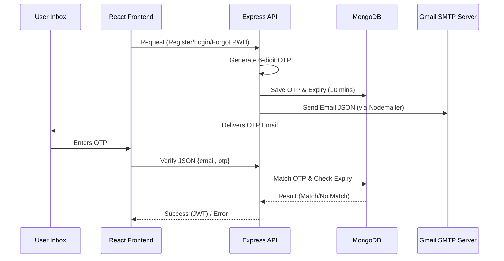

# Email & OTP Workflow in TourPlanner

This document outlines the end-to-end process for sending and verifying emails (OTPs) in the TourPlanner application.

## 1. High-Level Flow



## 2. Key Components

### A. The Mailer Utility
- **Location**: `backend/utils/sendEmail.js`
- **Technology**: [Nodemailer](https://nodemailer.com/)
- **Configuration**:
    - **Service**: Gmail
    - **Authentication**: Uses `EMAIL_USER` and `EMAIL_PASS` (App Password) from `.env`.
- **Purpose**: A reusable function that takes `options` (email, subject, message) and sends an HTML email.

### B. The Auth Controller
- **Location**: `backend/controllers/authController.js`
- **Logic**:
    1. **Register**: Creates a user with `isVerified: false` and sends a verification OTP.
    2. **Login**: Sends a security verification code even if credentials are correct (2FA).
    3. **Forgot/Reset**: Sends a reset OTP to allow password change.
    4. **Resend**: Refreshes the OTP and expiry before sending a new email.

### C. Database Model
- **Location**: `backend/models/User.js`
- **Fields**:
    - `otp`: Stores the current 6-digit code.
    - `otpExpires`: Date object set to 10 minutes after generation.
    - `isVerified`: Boolean flag for account activation.

---

## 3. Step-by-Step Execution

### Step 1: Triggering the Email
When a user clicks "Signup" or "Login", the frontend sends a POST request to the backend.
- **Endpoint**: `/api/auth/register` or `/api/auth/login`

### Step 2: Backend Generation
The backend executes the following code block:
```javascript
const otp = Math.floor(100000 + Math.random() * 900000).toString();
const otpExpires = new Date(Date.now() + 10 * 60 * 1000); // 10 minutes
```

### Step 3: Sending via Gmail
The `sendEmail` tool is called. Gmail acts as the relay to deliver the message to the user's provider (Outlook, Yahoo, etc.).

### Step 4: Verification
The user inputs the code on the `/verify-otp` or similar screen.
- **Backend checks**: `user.otp === req.body.otp && user.otpExpires > Date.now()`

---

## 4. Troubleshooting
If emails are not arriving:
1. **Check `.env`**: Ensure `EMAIL_USER` and `EMAIL_PASS` are correct.
2. **Gmail Security**: Gmail requires an **"App Password"** generated from Google Account settings, not your regular password.
3. **Console Logs**: Check the backend terminal for "Email sent successfully" or specific error messages.
